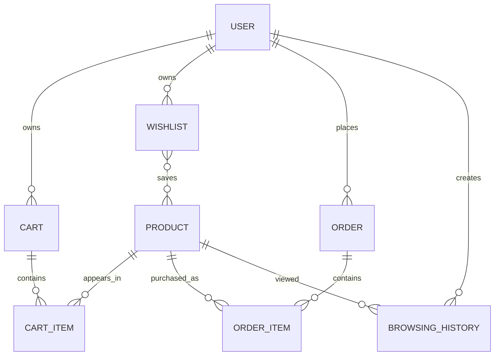
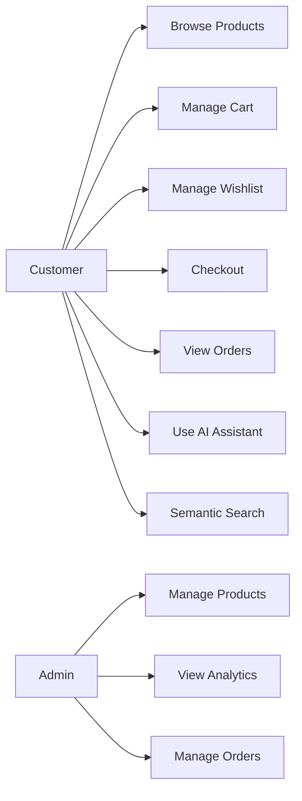
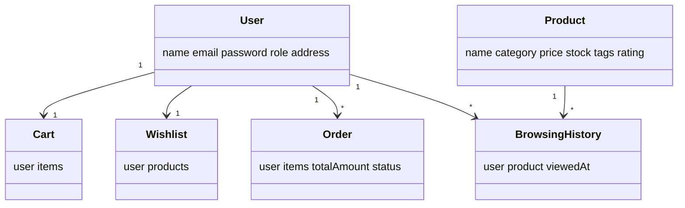
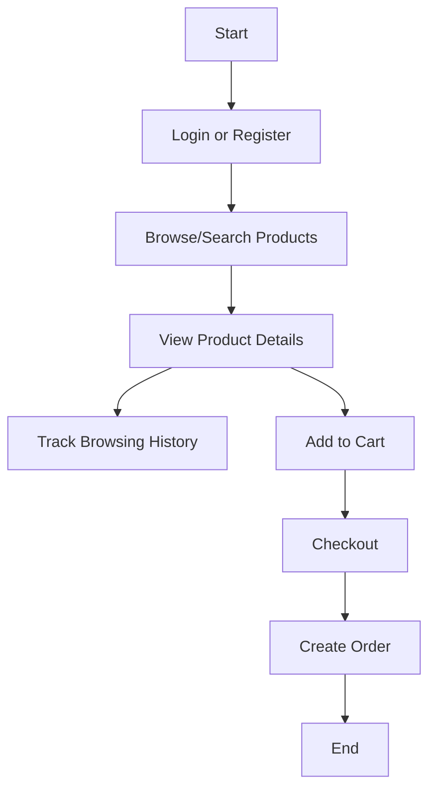
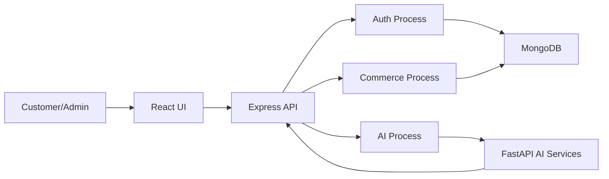

# Project Diagrams

## ER Diagram

```mermaid
erDiagram
  USER ||--o{ CART : owns
  USER ||--o{ WISHLIST : owns
  USER ||--o{ ORDER : places
  USER ||--o{ BROWSING_HISTORY : creates
  PRODUCT ||--o{ CART_ITEM : appears_in
  PRODUCT ||--o{ ORDER_ITEM : purchased_as
  PRODUCT ||--o{ BROWSING_HISTORY : viewed
  CART ||--o{ CART_ITEM : contains
  ORDER ||--o{ ORDER_ITEM : contains
  WISHLIST }o--o{ PRODUCT : saves
```

## Use Case Diagram

```mermaid
flowchart LR
  Customer["Customer"] --> Browse["Browse Products"]
  Customer --> Cart["Manage Cart"]
  Customer --> Wishlist["Manage Wishlist"]
  Customer --> Checkout["Checkout"]
  Customer --> Orders["View Orders"]
  Customer --> Assistant["Use AI Assistant"]
  Customer --> Semantic["Semantic Search"]
  Admin["Admin"] --> Products["Manage Products"]
  Admin --> Analytics["View Analytics"]
  Admin --> OrderMgmt["Manage Orders"]
```

## Class Diagram

```mermaid
classDiagram
  class User { name email password role address }
  class Product { name category price stock tags rating }
  class Cart { user items }
  class Wishlist { user products }
  class Order { user items totalAmount status }
  class BrowsingHistory { user product viewedAt }
  User "1" --> "1" Cart
  User "1" --> "1" Wishlist
  User "1" --> "*" Order
  User "1" --> "*" BrowsingHistory
  Product "1" --> "*" BrowsingHistory
```

## Activity Diagram

```mermaid
flowchart TD
  Start["Start"] --> Login["Login or Register"]
  Login --> Browse["Browse/Search Products"]
  Browse --> Detail["View Product Details"]
  Detail --> History["Track Browsing History"]
  Detail --> Cart["Add to Cart"]
  Cart --> Checkout["Checkout"]
  Checkout --> Order["Create Order"]
  Order --> End["End"]
```

## DFD Level 1

```mermaid
flowchart LR
  User["Customer/Admin"] --> Client["React UI"]
  Client --> API["Express API"]
  API --> Auth["Auth Process"]
  API --> Commerce["Commerce Process"]
  API --> AI["AI Process"]
  Auth --> DB["MongoDB"]
  Commerce --> DB
  AI --> Services["FastAPI AI Services"]
  Services --> API
```

