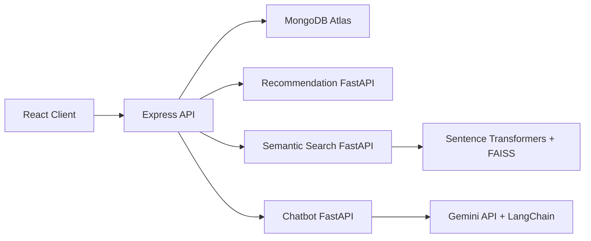

# System Architecture

SmartCommerce AI uses a modular architecture:

- React client renders the customer portal and admin dashboard.
- Express API handles authentication, RBAC, commerce resources, and AI proxy endpoints.
- MongoDB stores users, products, carts, wishlists, orders, and browsing history.
- FastAPI services provide recommendations, semantic search, and chatbot responses.

## Clean Architecture Layers

- Presentation: React pages and components.
- Application: Redux slices and API services.
- API Layer: Express routes and controllers.
- Domain Models: Mongoose schemas.
- AI Layer: FastAPI inference services.
- Infrastructure: MongoDB Atlas, Vercel, Render.

